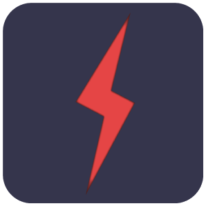
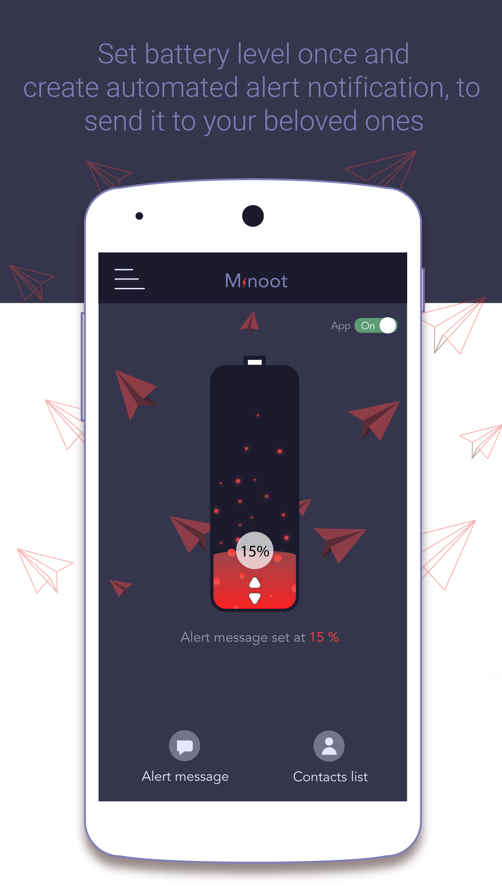
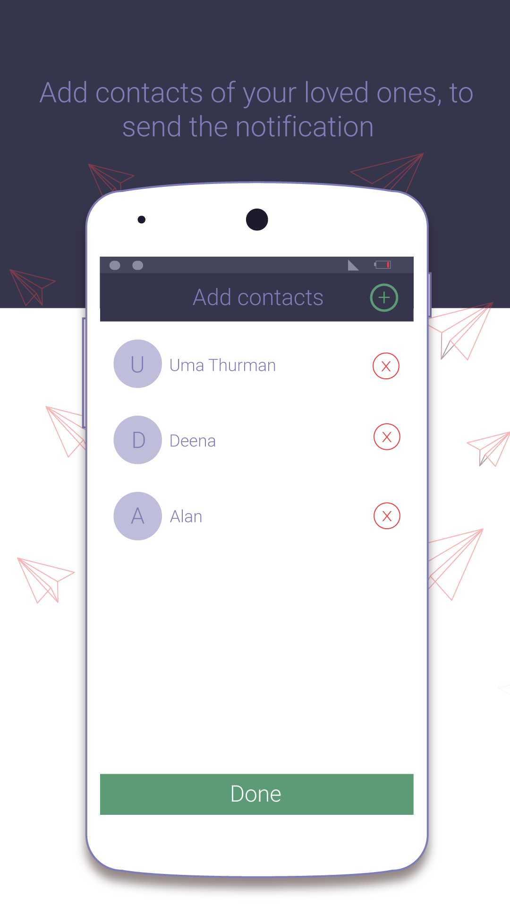
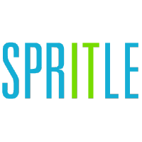

# Minoot

<b><i>Minoot</i></b>        is a simple way to send alert notification to our beloved ones when the battery is low and before its getting switched off. This will avoid our beloved ones getting panic when our mobile gets switched off due to low battery.       

   Minoot is now available in the [Play Store](https://play.google.com/store/apps/details?id=com.spritle.batteryapp) 

  

## Features    

* #### Set Alert level
  Set the battery alert level in an aesthetic UI     

* #### Add Recipients      
  Add from your contacts multiple members you would want to be notified      

* #### Customize Message      
  Customize the alert message to want to be sent out    

* #### Messaging     
  Uses mobile network and sends notification through SMS      

* #### Processing    
  Very light on your mobile processor memory and battery      

## Screenshots

### Licensing
Minoot is licensed under the [GNU v3 Public License](https://github.com/HoraApps/LeafPic/blob/master/LICENSE).
In addition to the terms set by the GNU v3 Public License, we ask that if you use any code from this repository that you send us a message to let us know.      

### Team   

     

Minoot is build by [Spritle Software](https://www.spritle.com/) . We ❤ open source and build products using Ruby, Rails, Node JS, Java, Android, Swift, React Native etc .

